# Implementation Plan: Facebook AI Agent Rebuild

## Overview

In-place refactor of `src/agent/` into a deterministic, model-agnostic Messenger commerce agent. The LLM is reduced to a tool selector. Deterministic TypeScript carries reliability via:

- An extended `AgentSnapshot` persisted in `MessengerConversation.pendingDraftJson`.
- An explicit `OrderFSM` with allowed-transition table in `state.ts`.
- A 10-step `AgentLoop` with per-step `AgentTrace` rows and explicit confidence scoring.
- A deterministic `ProductResolver` + Banglish synonym layer + Reference Resolver.
- A 3-layer anti-hallucination defence (cart-mutation SKU guard, reply filter, confirmation guard).
- Long-term memory persisted to `CustomerProfile.preferences`; abandoned-cart resume via `FollowUp`.

No new agent module is introduced (no `src/agent2/`). Existing tools stay; new tools (`resolve_product_name`, `check_inventory`, `modify_cart_item`, `save_session_state`, `retrieve_session_state`, `validate_order`, long-term memory R/W) are added alongside them. `add_to_cart` and `remove_from_cart` are registered under canonical aliases (`update_cart`, `remove_cart_item`) without removing the existing names — see task 7.1 for the rationale.

No Prisma migration needed: `pendingDraftJson`, `preferences`, `AgentTrace`, and `FollowUp` already exist.

## Tasks

- [x] 1. Foundations — Snapshot, FSM, thresholds
  - [x] 1.1 Extend `AgentSnapshot` shape with the new structured-state fields
    - In `src/agent/types.ts`, add fields to `AgentSnapshot`: `active_goal`, `order_state` (OrderFSMState), `missing_information` (array of `{ line_id?, slot, attempts }`), `confirmed_information` (record), `customer_preferences`, `conversation_summary` (short string), `confidence_level` (0–1), `followup_needed` (boolean), `recent_references` (last 5 resolved references with `{ phrase, target_kind, target_id, ts }`).
    - Keep existing fields (`cart`, `profile`, `shownSkus`, `lastShown`).
    - In `src/agent/state.ts`, update `loadSnapshot` to read each new field defensively (safe defaults: empty arrays / objects, `BROWSING`, `1.0`) so legacy `pendingDraftJson` blobs still parse.
    - Update `saveSnapshot` to round-trip every new field into `pendingDraftJson` without dropping unrelated keys (the existing spread pattern is the model).
    - Verification: TypeScript compile (`npm run build`); unit-load a fixture `pendingDraftJson` that lacks the new keys and assert `loadSnapshot` returns the documented defaults.
    - _Requirements: 1.1, 1.2, 1.3, 1.4, 13.1, 15.2_

  - [x] 1.2 Add the `OrderFSM` enum and allowed-transition table
    - In `src/agent/state.ts`, export an `OrderFSMState` union/enum with exactly: `BROWSING`, `PRODUCT_SELECTION`, `CART_BUILDING`, `MISSING_INFO_COLLECTION`, `ADDRESS_COLLECTION`, `PAYMENT_SELECTION`, `ORDER_REVIEW`, `FINAL_CONFIRMATION`, `ORDER_COMPLETE`.
    - Export `ALLOWED_TRANSITIONS: Record<OrderFSMState, OrderFSMState[]>` and a `canTransition(from, to, snapshot)` helper that also checks deterministic preconditions (e.g. `CART_BUILDING` requires `cart.length >= 1`; `ADDRESS_COLLECTION` requires `missing_information` has no per-line slots; `FINAL_CONFIRMATION` requires `profile.name && profile.phone && profile.address`).
    - Export a `nextSuggestedState(snapshot)` helper used later by the loop to pick the next state when an LLM-proposed action would skip ahead.
    - Verification: compile; unit test `canTransition` over the full transition table including a representative skip-violation case.
    - _Requirements: 7.1, 7.2, 7.3, 7.4_

  - [x] 1.3 Define confidence-score thresholds and runtime constants
    - In `src/agent/state.ts`, export `CONFIDENCE_THRESHOLDS = { high: 0.8, medium: 0.55, low: 0.3 }` (numbers chosen to match Req 11.3; values may be tuned later via tenant settings).
    - Export `ABANDONED_CART_TIMEOUT_MS` (default 24h) and `MAX_SLOT_ATTEMPTS = 2` (used by the Anti-Loop Guard).
    - Add a brief JSDoc on each constant explaining how it is consumed.
    - Verification: compile; the constants are imported in tasks 5.3, 6.4, 9.3.
    - _Requirements: 11.3, 8.5, 12.6, 13.3_

- [x] 2. Cart core — line_id, structured slots, mutations
  - [x] 2.1 Give every cart line a stable `line_id` and add `modify_cart_item`
    - In `src/agent/types.ts`, add `line_id: string` (cuid-style; generated via `crypto.randomUUID()`) to `AgentCartItem`. Keep existing fields (`sku`, `product`, `quantity`, `size`, `unitPriceBdt`, `addOns`).
    - In `src/agent/state.ts`, on `loadSnapshot`, mint a `line_id` for any legacy line that lacks one before returning.
    - In `src/agent/tools/cart.ts`:
      - Generate a `line_id` whenever `add_to_cart` appends a new line (preserve the existing "merge by sku+size" behaviour, but expose the merged line's stable `line_id` in the observation).
      - Add a new `modify_cart_item` tool: args `{ line_id, quantity?, size?, unitPriceBdt? }`; updates only the targeted line, preserves prior slot values when an arg is omitted, refuses on unknown `line_id`.
      - Re-key `remove_from_cart` to accept `{ line_id }` (keep accepting `{ sku }` for backward compatibility — when both are absent or both present and conflicting, return a validation error).
    - Verification: compile; unit test "add A → add B → modify B size to L → remove A by line_id" leaves the cart with one line equal to B with size=L.
    - _Requirements: 2.2, 3.3, 3.4, 3.5_

  - [x] 2.2 Per-line missing-slot tracking + auto-update of `missing_information`
    - In `src/agent/tools/cart.ts`, after every cart mutation (`add_to_cart`, `modify_cart_item`, `remove_cart_item`), recompute the per-line missing slots: `size` (when not set and the SKU has variants), `quantity` (always implicit), and any required customisation slot (e.g. `name-number` if attached but value missing).
    - Mirror those into `snapshot.missing_information` keyed by `line_id` before calling `ctx.saveSnapshot`. When a line is removed, drop its missing-slot rows.
    - When a slot is filled (size captured by `add_to_cart`/`modify_cart_item`, value captured by `set_line_addons`), move that slot from `missing_information` into `confirmed_information` in the same turn.
    - Verification: unit test asserts that after `add_to_cart {sku, qty:1}` (no size), `missing_information` contains exactly one row with `slot="size"` and the correct `line_id`; after a follow-up `modify_cart_item {line_id, size:"L"}` it disappears and `confirmed_information[line_id].size === "L"`.
    - _Requirements: 8.1, 8.2, 8.4, 8.6_

  - [x] 2.3 Subtotal / line_total recompute and surface order-level fields
    - Inside the cart write paths in `src/agent/tools/cart.ts`, compute `line_total = (unitPriceBdt + sum(addOns.priceBdt)) * quantity` per line and store it on the line.
    - Compute `subtotal = sum(line_total)` and persist a structured cart object inside the Snapshot containing `{ items, subtotal, delivery_info, payment_method, order_status }` (use values already known on the Snapshot for `delivery_info`/`payment_method`/`order_status`; default to nulls).
    - The `show_cart` tool already renders this — update it to read from the structured fields instead of recomputing.
    - Verification: compile; unit test asserts that a 2-line cart produces the expected `subtotal` and per-line `line_total`.
    - _Requirements: 2.1, 2.3, 2.5, 2.6_

  - [ ]* 2.4 Unit test — multi-item round-trip
    - New test file under `src/agent/__tests__/cart.multi.test.ts`.
    - Drive the cart tools via the `ToolHandlerCtx` interface with a fake `saveSnapshot` capturing each write.
    - Assert that the input "2 Real Madrid jerseys size L + 1 football boot size 42" results in exactly three cart lines (or two when the merge collapses identical sku+size), each with the specified `product_name`, `quantity`, `size`, and a non-empty `line_id`.
    - _Requirements: 3.1, 3.2, 3.6_

- [x] 3. Product resolution
  - [x] 3.1 Add the `resolve_product_name` tool
    - New file `src/agent/tools/resolve.ts` exporting a `resolveTools: ToolDef[]` array.
    - Lift the TF-IDF scoring from `src/agent/tools/catalog.ts` (`tokenize`, `GENERIC_TOKENS`, `scoreRow`, `buildDocumentBlobs`) into a shared helper in the same file (or in `src/agent/productScorer.ts`); have `search_catalog` and `resolve_product_name` both consume it so future changes stay in one place.
    - `resolve_product_name` args: `{ query: string, limit?: number }`; returns up to N candidates each with `{ product_id, product_name, confidence_score }` where the score is derived from the row's TF-IDF score normalised against the top score (0..1).
    - The tool MUST refuse to return any `product_id` not present in the active tenant catalog (Req 4.6).
    - Verification: compile; unit test "argentina terrace kit" returns the Argentina Terrace row with `confidence_score >= 0.8`; "kichu jersey" returns no row above 0.8.
    - _Requirements: 4.1, 4.2, 4.4, 4.6, 6.1_

  - [x] 3.2 Add the `check_inventory` tool
    - In `src/agent/tools/resolve.ts` (or `src/agent/tools/inventory.ts` — pick one and stay consistent), add `check_inventory` with args `{ sku: string, size?: string }`.
    - Lift `sizeStockFromMeta` and `coerceNumber` from `src/agent/tools/cart.ts` into a shared helper module (e.g. `src/agent/tools/inventoryHelpers.ts`) so both `add_to_cart` and `check_inventory` read identical numbers. Update `add_to_cart` to import from the helper.
    - Return `{ in_stock: boolean, stock: number | null, sku, size, is_active }`.
    - Verification: compile; unit test asserts variant-level lookup precedes aggregate `stock`.
    - _Requirements: 6.1, 10.1, 10.4_

  - [x] 3.3 Banglish synonym map module
    - New file `src/agent/synonyms.ts` exporting `BANGLISH_SYNONYMS: Record<string, string[]>` plus `expandQuery(q: string): string` and `normaliseToken(t: string): string`.
    - Include at minimum: `rm jersey → real madrid`, `nike boot → nike football boot`, `arg → argentina`, `bd jersey → bangladesh jersey`, casual yes/no (`ji`, `hae`, `na`), product-class shorthands (`kit`, `tshirt`).
    - Use the helper inside the TF-IDF tokenizer (task 3.1) so synonym hits boost scoring.
    - Verification: compile; unit test asserts "rm jersey M" tokenises to include "real" and "madrid"; "ji" maps to a yes-confirm token.
    - _Requirements: 4.2, 4.3_

  - [x] 3.4 Anti-hallucination guard — forbid unknown SKU on cart-mutating tools
    - In `src/agent/tools/cart.ts` (`add_to_cart`, `modify_cart_item`), before doing the Prisma lookup, check that the supplied `sku` (when relevant) is present in `ctx.snapshot.shownSkus` OR `ctx.snapshot.lastShown[*].sku` OR was returned by a tool result earlier in the same turn (passed in via `ctx.input` or the existing observation trail).
    - If not, refuse with `{ ok: false, error: "sku_not_grounded", observation: "..." }` and log an `AgentTrace` row through the override channel from task 10.2.
    - Mirror the same check in any new resolver-driven path.
    - Verification: compile; unit test asserts that calling `add_to_cart {sku: "MADE-UP-9999"}` without prior search/resolve returns `sku_not_grounded` and does NOT mutate the cart.
    - _Requirements: 6.4, 10.1, 10.5_

- [x] 4. Reference resolution
  - [x] 4.1 Add a deterministic `referenceResolver`
    - New file `src/agent/referenceResolver.ts` exporting `resolveReference(snapshot, message): { kind: "line"|"product"|"none", line_id?, product_id?, confidence_score, debug }`.
    - Implement the following lookup priority (deterministic, no LLM):
      1. `lastShown` ordinal (`prothom ta`, `1 ta`, `first one`, `2`).
      2. Cart ordinal (`first item`, `second one`).
      3. Cart attribute match (`make the boot size 42` → line whose `product` matches "boot"; `the red one` → matches `addOns` or `product` colour token).
      4. Product code match in `lastShown[*].label` (e.g. `WC26 ta`).
      5. Fuzzy match against cart `product_name` via the helper from 3.1.
    - Return `confidence_score` derived from the matching path (1.0 for exact ordinal/code, ≥0.8 for unambiguous fuzzy, lower otherwise).
    - Verification: compile; unit tests cover each priority branch including the disambiguation case from Req 9.4.
    - _Requirements: 9.1, 9.2, 9.3, 9.4_

  - [x] 4.2 Persist `recent_references` (last 5) into the Snapshot
    - In `src/agent/state.ts`, on every successful resolution call append `{ phrase, target_kind, target_id, ts }` to `snapshot.recent_references` and trim to 5 most recent.
    - Wire this from inside `resolveReference` via a callback parameter so the resolver stays pure (the loop is the only writer).
    - Verification: compile; unit test confirms the FIFO trimming.
    - _Requirements: 9.6_

  - [x] 4.3 Wire the resolver into the AgentLoop before any cart mutation
    - In `src/agent/loop.ts`, between router decision and `tool.handler` invocation, when the chosen tool is one of `update_cart` / `add_to_cart` / `modify_cart_item` / `remove_cart_item` / `set_line_addons`, run `resolveReference(snapshot, input.userText)` first and overwrite the tool args with the resolved `line_id` / `sku` when ambiguity is below the high-confidence threshold from 1.3.
    - If `confidence_score < high`, abort the tool call and emit a clarification step (re-route to `reply` asking the customer to disambiguate, listing candidates).
    - Verification: compile; integration test "make the boot size 42" with a jersey + boot cart routes to `modify_cart_item` against the boot's `line_id`.
    - _Requirements: 9.2, 9.4, 9.5, 12.5_

- [ ] 5. AgentLoop reasoning
  - [x] 5.1 Restructure `src/agent/loop.ts` into the explicit 10-step pipeline
    - Replace the single `routeAndExecute` node with a sequence of named node functions: `observeInput`, `retrieveSession`, `retrieveCart`, `detectIntent` (LLM), `detectMissingInfo` (deterministic), `chooseAction` (LLM), `chooseTools` (LLM via existing router), `verifyPreResponse` (deterministic), `generateResponse` (LLM), `saveMemory`.
    - Keep using `@langchain/langgraph` `StateGraph`; add a node per step. Mark each node in code comments as `// LLM` or `// deterministic` (per Req 5.5 only `detectIntent`, `chooseAction`, `chooseTools`, `generateResponse` may invoke the LLM).
    - Preserve `MAX_ITER` and the existing tool-routing inside `chooseTools`/handler invocation so the rest of the codebase is unaffected.
    - Verification: compile; smoke run a single inbound through the loop and assert all ten step names appear in the produced `steps[]`.
    - _Requirements: 5.1, 5.4, 5.5_

  - [x] 5.2 Emit one `AgentTrace` row per step
    - In `src/agent/trace.ts`, extend `AgentStepLog` (in `types.ts`) with `step: "observe_input" | ...` and the three confidence scores `{ product_match, intent, order_completeness }`.
    - In `persistTurnTrace`, write one row per step (not just per tool), using the `step` value as the `tool` column when no tool was executed (e.g. `step="observe_input"`, `tool="(step)"`). Keep the existing row shape so the column set in `prisma/schema.prisma` (`AgentTrace`) stays unchanged.
    - Add `fsmState` and `confidenceLevel` into the `args` JSON column for every row (no schema migration needed — `args` is already `Json?`).
    - Verification: compile; integration test asserts ≥10 rows per turn with distinct `step` values and a populated `confidenceLevel`.
    - _Requirements: 5.2, 5.3, 11.6, 15.1, 15.2_

  - [x] 5.3 Implement the Anti-Loop Guard for slot questions
    - In `src/agent/loop.ts`, before generating the customer-facing reply, look up `snapshot.missing_information[i].attempts` for the slot the reply is about to ask about.
    - If `attempts >= MAX_SLOT_ATTEMPTS`, swap the reply for an escalation/fallback (call `escalate_to_human` or render a clarification fallback summarising the items already understood per Req 12.1).
    - Increment `attempts` for the slot whenever a question is asked about it; reset to 0 once the slot moves to `confirmed_information`.
    - Reuse the existing same-tool-args duplicate guard already present in `loop.ts` and replace its message with the FSM-aware fallback path.
    - Verification: compile; unit test simulates three turns asking for "address" and asserts the third turn produces the escalation/fallback reply, not another address question.
    - _Requirements: 8.5, 12.6, 14.5_

  - [x] 5.4 FSM transition enforcement inside the loop
    - In the `chooseAction` node (task 5.1), after the LLM proposes the next tool, derive the implied target FSM state (e.g. `confirm_order` implies `FINAL_CONFIRMATION`). Run `canTransition(snapshot.order_state, implied, snapshot)` from task 1.2.
    - If the transition is illegal, override the action by routing to `nextSuggestedState(snapshot)` (e.g. force `MISSING_INFO_COLLECTION` when slots are missing); log the override via the channel from task 10.2.
    - On `ORDER_COMPLETE`, clear `cart` and reset `order_state` to `BROWSING` per Req 7.6.
    - Verification: compile; unit test attempts `confirm_order` when `missing_information` is non-empty and asserts the loop reroutes to a slot-collection action.
    - _Requirements: 7.4, 7.5, 7.6_

- [x] 6. Confidence scoring
  - [x] 6.1 Product-match score
    - In `src/agent/tools/resolve.ts` (task 3.1), surface the per-row TF-IDF score normalised to `[0, 1]` as `confidence_score` on every returned candidate. Do the same in `search_catalog`'s `data` payload so downstream tools share one definition.
    - Verification: compile; covered by the unit test in 3.1.
    - _Requirements: 11.1, 4.4_

  - [x] 6.2 Intent-detection score
    - New file `src/agent/intentClassifier.ts` exporting `classifyIntent(message): { intent, confidence_score }`. Implement a tiny deterministic keyword/regex classifier (categories: `browse`, `add_item`, `modify_item`, `remove_item`, `ask_size`, `ask_photo`, `provide_profile`, `confirm_order`, `payment_query`, `delivery_query`, `greeting`, `escalate`).
    - Score = matched-token coverage; below `medium` threshold falls back to letting the LLM provide a self-reported score (the router output already carries `thought`; extend the schema to optionally include `intent_confidence: number`).
    - Verification: compile; unit table-test of representative Banglish strings.
    - _Requirements: 11.1_

  - [x] 6.3 Order-completeness score
    - In `src/agent/state.ts`, export `computeOrderCompleteness(snapshot): number` returning a deterministic `[0, 1]` score derived from: `missing_information.length`, FSM state advancement, profile completeness, and presence of validated cart lines.
    - Verification: compile; unit test confirms the score is `1.0` only when `missing_information` is empty and FSM ≥ `FINAL_CONFIRMATION`.
    - _Requirements: 11.1, 11.5_

  - [x] 6.4 Update `Snapshot.confidence_level` to the minimum of the three scores
    - In `src/agent/loop.ts`, at the end of `verifyPreResponse`, compute `min(product_match, intent, order_completeness)` and write it into `snapshot.confidence_level` before `saveMemory`.
    - When the score is below `medium`, route to a clarification flow (Req 11.4); when below `high` and FSM is `FINAL_CONFIRMATION`, roll FSM back to `ORDER_REVIEW` (Req 11.5).
    - Verification: compile; integration test pushes the confidence below medium and asserts the loop produces a clarification reply.
    - _Requirements: 11.2, 11.4, 11.5, 11.6_

- [x] 7. Tool registry alignment and new tools
  - [x] 7.1 Register canonical tool names alongside existing ones
    - In `src/agent/tools/registry.ts`, register both names for tools that the requirements name differently from the codebase. **Decision: alias rather than rename** — keep `add_to_cart`, `remove_from_cart`, `search_catalog` as primary handlers (they are referenced from many places: `prompts.ts`, runner fallback text, addon flow). Register `update_cart`, `remove_cart_item`, `search_products` as **alias entries** in the same `TOOLS` array that point at the same `handler` and `paramsSchema` but with a distinct `name`. The `findTool` lookup will resolve either.
    - Add the new tools from tasks 2.1, 3.1, 3.2, 7.2, 7.3, 7.4 to `TOOLS`.
    - Verification: compile; unit test asserts `findTool("update_cart") === findTool("add_to_cart")` (same handler reference) and that every name from Req 6.1 is present.
    - _Requirements: 6.1, 6.2, 6.3, 6.4, 6.5_

  - [x] 7.2 Add the `validate_order` tool
    - New file `src/agent/tools/validate.ts` exporting `validateOrderTools: ToolDef[]`.
    - The tool re-verifies every cart line against `prisma.productMapping` (active flag, per-size stock, current `unitPriceBdt`, allowed add-ons via `resolveProductAddons`) and returns `{ ok: boolean, failures: Array<{ line_id, code, detail }>, totals }`.
    - In `src/agent/tools/confirm.ts`, mark `confirm_order` as refusing to run when the most recent `validate_order` result has `ok=false` (carry the result in the Snapshot or in a transient turn-scoped field — pick one and document).
    - Verification: compile; unit test seeds an inactive SKU into a cart, runs `validate_order`, then asserts `confirm_order` refuses with the validation reason surfaced.
    - _Requirements: 6.6_

  - [x] 7.3 Add `save_session_state` and `retrieve_session_state` tools
    - New file `src/agent/tools/session.ts` exporting `sessionTools: ToolDef[]`.
    - `save_session_state` writes the full `AgentSnapshot` to `pendingDraftJson` via `saveSnapshot`; `retrieve_session_state` reads it via `loadSnapshot`. They are explicit so the LLM can request a save/load when the loop's automatic write is insufficient (per Req 13.6 these MUST be the path through ToolRegistry for memory operations).
    - Verification: compile; round-trip test confirms a save followed by a load returns the same Snapshot shape.
    - _Requirements: 13.1, 13.6_

  - [x] 7.4 Add the long-term memory read/write tool
    - In `src/agent/tools/memory.ts`, add two tools alongside the existing `recall_customer` / `note_preference`:
      - `read_long_term_memory` args `{ keys?: string[] }` returns `CustomerProfile.preferences` (filtered to the requested keys when supplied).
      - `write_long_term_memory` args `{ patch: Record<string, unknown> }` merges the patch into `CustomerProfile.preferences` via the existing `notePreference` infrastructure.
    - Both refuse on unknown psid; keep `bumpLeadScore` semantics from `note_preference`.
    - Verification: compile; unit test confirms read-after-write round-trip.
    - _Requirements: 13.2, 13.5, 13.6_

- [x] 8. Prompt rebuild and router rendering
  - [x] 8.1 Replace the 25-rule prompt with a minimal LLM-as-tool-selector prompt
    - In `src/agent/prompts.ts`, replace `AGENT_SYSTEM_PROMPT` with a much shorter prompt whose only responsibilities are: pick the next tool, follow the JSON output schema, never invent SKUs, respect Banned_Word list, and defer to deterministic guards (FSM, anti-loop, anti-hallucination, reply filter).
    - Keep `AGENT_OUTPUT_SCHEMA_HINT` and the banned-word block; drop rules that are now enforced in code (sections 4–21 of the current prompt are largely subsumed by the new deterministic guards).
    - Document in a top-of-file comment that the prompt is intentionally minimal and that the deterministic layers (FSM in 1.2, Anti-Loop Guard in 5.3, Anti-Hallucination Guards in 3.4 and 10.1) are the safety net.
    - Verification: compile; manual repro on a representative turn and confirm the router still picks valid tools.
    - _Requirements: 14.1, 14.3_

  - [x] 8.2 Update `src/agent/router.ts` to render the new Snapshot block
    - Replace the existing `renderSnapshot` body so the LLM sees: `order_state`, structured cart summary (item count, subtotal, `line_id` per line), `missing_information` (slot list), `confirmed_information` (compact key=value list), `recent_references` (last 5), `confidence_level`, and the existing `lastShown` block (still needed for ordinal references).
    - Drop fields the LLM no longer needs (the giant `shownSkus` blob can stay, capped to N).
    - Verification: compile; manual repro confirms the rendered prompt fits in a typical `num_predict` budget on Gemma 3 1B.
    - _Requirements: 1.1, 1.6, 9.6, 11.2_

- [x] 9. Memory persistence
  - [x] 9.1 Persist `customer_preferences` to `CustomerProfile.preferences` every turn
    - In `src/agent/loop.ts` `saveMemory` step (task 5.1), at the end of every turn, diff `snapshot.customer_preferences` against the prior `CustomerProfile.preferences` and write the merged result via `notePreference`.
    - Capture at minimum: `favorite_teams`, `recent_sizes`, `last_5_orders` (push the just-confirmed order id into a bounded list of 5). Use the existing `customerProfile.ts` helpers.
    - Verification: compile; integration test confirms a turn that adds an Argentina jersey persists `favorite_teams: ["argentina"]` into `preferences`.
    - _Requirements: 1.5, 13.2, 13.5_

  - [x] 9.2 Abandoned-cart resume flow
    - In `src/agent/runner.ts`, after `loadSnapshot`, when the snapshot has a non-empty `cart`, a `recent_references[0].ts` (or `pendingDraftJson.updatedAt`) within the abandoned-cart timeout window from 1.3, and `order_state` is one of `CART_BUILDING`, `MISSING_INFO_COLLECTION`, `ADDRESS_COLLECTION`, `PAYMENT_SELECTION`, render a "welcome back" preamble in the history before invoking `runAgentTurn`.
    - The loop then resumes at the saved `order_state` because the FSM was persisted.
    - Verification: compile; integration test seeds a snapshot with `order_state="ADDRESS_COLLECTION"` and a 12h-old timestamp, sends an inbound, and confirms the next reply is an address question (not a fresh greeting).
    - _Requirements: 13.4_

  - [x] 9.3 Drive abandoned-cart `FollowUp` scheduling from the FSM
    - In `src/agent/tools/cart.ts`, the existing `scheduleFollowUp` call inside `add_to_cart` already exists. Move the schedule decision into `src/agent/followUp.ts` so it triggers on FSM transitions: schedule a `FollowUp` whenever the loop ends in `CART_BUILDING` / `MISSING_INFO_COLLECTION` / `ADDRESS_COLLECTION` / `PAYMENT_SELECTION` with a non-empty cart; cancel any pending follow-up on `ORDER_COMPLETE`.
    - Use `ABANDONED_CART_TIMEOUT_MS` from task 1.3.
    - Verification: compile; unit test confirms a follow-up is scheduled on an in-flight FSM and cancelled when FSM advances to `ORDER_COMPLETE`.
    - _Requirements: 13.3_

- [x] 10. Reply filter / anti-hallucination defence
  - [x] 10.1 Extend `src/agent/replyFilter.ts`
    - Add a function `filterReply(text, lastVerifiedToolResults, traceSteps): { text, overrides[] }` that:
      - (a) Strips product attributes (price, stock, size, variant) not present in `lastVerifiedToolResults`.
      - (b) Enforces the existing banned-word list (keep current behaviour).
      - (c) Blocks confirmation phrases ("order confirmed", "thank you for your purchase", "payment received", and Banglish equivalents) unless the most recent successful step in `traceSteps` was `create_order` returning `ok=true` with a persisted order id.
      - Returns the cleaned text plus an `overrides[]` array describing each modification.
    - Wire `filterReply` into the loop's `generateResponse` step (task 5.1), replacing the current `sanitizeCustomerReply` call inside `runner.ts` with a call to the new function.
    - Verification: compile; unit test asserts that a reply containing "Apnar order confirmed!" without a preceding `create_order` step is rewritten to "Apnar order list ready, confirm korben?".
    - _Requirements: 10.1, 10.2, 10.3, 10.6, 14.2, 14.3, 14.6_

  - [x] 10.2 Log every override as an `AgentTrace` row
    - In `src/agent/trace.ts`, add `recordOverride({ kind, original, corrected, reason })` that writes an `AgentTrace` row with `tool="(override)"`, the original text in `args.original`, the corrected text in `observation`, and `errorCode` set to the override kind (`anti_hallucination`, `anti_loop`, `banned_word`, `fsm_block`).
    - Call from task 3.4, 5.3, 5.4, 10.1.
    - Verification: compile; integration test confirms an override row is written when the filter rewrites a banned word.
    - _Requirements: 10.6, 15.5_

- [x] 11. Debugging / telemetry
  - [x] 11.1 Add a `/admin/snapshot/:conversationId` developer endpoint
    - New route file under `src/routes/agentDebugRoutes.ts` mounted from the existing admin router. Authenticated via the same admin-portal middleware used by `tenantPortalRoutes.ts`.
    - Returns `{ snapshot, recent_traces: AgentTrace[] (last 10), last_verified_tools: { name, observation, data }[] }`.
    - Verification: compile; manual curl returns a populated payload for a recent conversation.
    - _Requirements: 15.6_

  - [x] 11.2 Structured log entries for every tool call and override
    - In `src/agent/loop.ts`, around the existing `logger.info` / `logger.warn` calls, replace the ad-hoc payloads with a structured shape: `{ event: "agent.tool_call" | "agent.override", tenantId, conversationId, turnId, iter, tool, args_redacted, result_id, latency_ms }`.
    - Match the redaction rules from `safety_guardrails` — never echo secrets in `args_redacted`.
    - Verification: compile; manual repro shows the new event names in `logs/`.
    - _Requirements: 15.4, 15.5_

- [x] 12. Regression root-cause analysis deliverable (Requirement 16)
  - [x] 12.1 Write `docs/REGRESSION-ANALYSIS.md` mapping causes to files
    - Categories required by Req 16.2: broken state logic, lost memory persistence, context window problems, prompting defects, cart architecture defects, weak tool orchestration, improper session handling.
    - For each category, identify the offending file(s) under `src/agent/` (e.g. broken state logic → `loop.ts`, `state.ts`; cart architecture defects → `tools/cart.ts`; prompting defects → `prompts.ts`) and the specific code-level cause.
    - Map every finding to the requirement number it is addressed by (1.x, 2.x, …, 14.x, 15.x).
    - Verification: file exists at `docs/REGRESSION-ANALYSIS.md`; spot-check the file/req mapping against the requirement document.
    - _Requirements: 16.1, 16.2, 16.3, 16.4, 16.6_

  - [x] 12.2 Add the four recommendation sections to the document
    - Append: `## Recommended Prompt Structure`, `## Recommended Database Schema Extensions`, `## Error Handling Strategy`, `## Session Memory Strategy`.
    - The schema-extensions section explicitly states that no Prisma migration is required because `pendingDraftJson`, `preferences`, `AgentTrace`, and `FollowUp` already cover the new fields; recommend optional future indexes (e.g. `AgentTrace(turnId, iter)` already exists).
    - Verification: file contains all four section headers.
    - _Requirements: 16.5_

- [ ] 13. Validation / smoke tests
  - [ ]* 13.1 Multi-item round-trip integration test
    - End-to-end through `runAgentInbound` against a fixture tenant catalog with Real Madrid jerseys and football boots.
    - Assert exactly three cart lines after the input "I want 2 Real Madrid jerseys size L and 1 football boot size 42", each with the correct `product`, `quantity`, and `size`.
    - _Requirements: 3.6_

  - [ ]* 13.2 Reference-resolution test
    - Seed a cart with a jersey line and a boot line. Send "make the boot size 42". Assert `modify_cart_item` is called against the boot's `line_id` and the jersey is unchanged.
    - _Requirements: 9.4_

  - [ ]* 13.3 FSM transition rejection test
    - Snapshot has empty profile fields and a non-empty cart. Force the LLM router output to `confirm_order`. Assert the loop overrides to a slot-collection action and the FSM stays at `MISSING_INFO_COLLECTION`.
    - _Requirements: 7.4_

  - [ ]* 13.4 Banned-word filter test
    - Force the router into a `reply` step whose text contains "checkout korte parben". Assert the outgoing text reads "order confirm korte parben".
    - _Requirements: 14.3_

  - [ ]* 13.5 Anti-Loop Guard test
    - Simulate three consecutive turns where the same slot ("delivery_address") remains unfilled. Assert the third turn produces an escalation/clarification fallback rather than another address question, and that `attempts` is `2` at the time of escalation.
    - _Requirements: 8.5, 12.6_

- [x] 14. Final checkpoint — Ensure all tests pass
  - Ensure all tests pass, ask the user if questions arise.

## Notes

- Tasks marked with `*` are optional and can be skipped for faster MVP. Production-readiness for Requirement 16 (regression analysis) and the deterministic guards in tasks 1–10 should not be skipped.
- Each task references specific requirement numbers from `requirements.md` for traceability.
- Property-based testing is **not** introduced for this rebuild because no design document with a Correctness Properties section was produced; the tests above are example-based unit and integration tests, which is appropriate for this LLM-driven workflow with deterministic guards.
- Canonical tool naming decision (task 7.1): we **alias** rather than rename. This keeps the existing prompt rules, runner fallback strings, and admin-portal references working unchanged while still satisfying Req 6.1's enumerated tool name list.
- All cart-mutation paths share one helper module for stock readout (task 3.2) so `add_to_cart` and `check_inventory` agree on inventory numbers at all times.
- `pendingDraftJson` stays the single source of truth for the in-flight Snapshot. `CustomerProfile.preferences` stays the single source of truth for long-term memory. No new Prisma columns are introduced.

## Task Dependency Graph

```mermaid
graph TD
  %% Wave 0 — foundations
  T1_1[1.1 Extend AgentSnapshot]
  T1_2[1.2 OrderFSM + transitions]
  T1_3[1.3 Confidence thresholds]
  T3_3[3.3 Banglish synonyms]
  T8_1[8.1 Minimal prompt]
  T12_1[12.1 Regression analysis doc]

  %% Wave 1 — cart + resolver primitives + scoring
  T2_1[2.1 line_id + modify_cart_item]
  T3_1[3.1 resolve_product_name]
  T3_2[3.2 check_inventory]
  T4_1[4.1 referenceResolver]
  T6_2[6.2 Intent classifier]
  T6_3[6.3 Order completeness score]
  T7_4[7.4 Long-term memory tool]
  T8_2[8.2 Router renderSnapshot]
  T10_1[10.1 Reply filter extend]
  T12_2[12.2 Doc recommendation sections]

  %% Wave 2 — cart slot tracking + loop restructure + new tools
  T2_2[2.2 Per-line missing slots]
  T3_4[3.4 SKU grounding guard]
  T4_2[4.2 recent_references persist]
  T5_1[5.1 10-step loop restructure]
  T6_1[6.1 Product-match score surface]
  T7_2[7.2 validate_order tool]
  T7_3[7.3 save/retrieve_session_state]

  %% Wave 3 — wiring + per-step tracing
  T2_3[2.3 Subtotal recompute]
  T4_3[4.3 Wire resolver into loop]
  T5_2[5.2 Per-step AgentTrace]
  T7_1[7.1 Registry alias canonical names]
  T9_3[9.3 Follow-up driven by FSM]
  T11_2[11.2 Structured tool-call logs]

  %% Wave 4 — guards depending on tracing + per-step pipeline
  T5_3[5.3 Anti-Loop Guard]
  T5_4[5.4 FSM enforcement in loop]
  T6_4[6.4 confidence_level minimum]
  T9_1[9.1 Persist customer_preferences]
  T9_2[9.2 Abandoned-cart resume]
  T10_2[10.2 Override AgentTrace rows]
  T11_1[11.1 /admin/snapshot endpoint]

  %% Wave 5 — tests
  T2_4[2.4 Cart multi-item unit test]
  T13_1[13.1 Multi-item round-trip]
  T13_2[13.2 Reference resolution]
  T13_3[13.3 FSM transition rejection]
  T13_4[13.4 Banned-word filter]
  T13_5[13.5 Anti-Loop Guard]

  %% Edges — foundations to wave 1
  T1_1 --> T2_1
  T1_1 --> T4_1
  T1_1 --> T8_2
  T1_2 --> T6_3
  T1_3 --> T6_3

  %% Wave 1 to wave 2
  T1_1 --> T2_2
  T2_1 --> T2_2
  T2_1 --> T3_4
  T1_1 --> T4_2
  T4_1 --> T4_2
  T1_1 --> T5_1
  T1_2 --> T5_1
  T1_3 --> T5_1
  T8_1 --> T5_1
  T3_1 --> T6_1
  T1_1 --> T7_2
  T1_1 --> T7_3
  T3_1 --> T3_2

  %% Wave 2 to wave 3
  T2_1 --> T2_3
  T4_1 --> T4_3
  T5_1 --> T4_3
  T5_1 --> T5_2
  T2_1 --> T7_1
  T3_1 --> T7_1
  T3_2 --> T7_1
  T7_2 --> T7_1
  T7_3 --> T7_1
  T7_4 --> T7_1
  T1_2 --> T9_3
  T5_1 --> T11_2

  %% Wave 3 to wave 4
  T5_1 --> T5_3
  T5_2 --> T5_3
  T5_1 --> T5_4
  T5_2 --> T5_4
  T1_2 --> T5_4
  T5_1 --> T6_4
  T6_1 --> T6_4
  T6_2 --> T6_4
  T6_3 --> T6_4
  T5_1 --> T9_1
  T5_1 --> T9_2
  T5_2 --> T10_2
  T10_1 --> T10_2
  T3_4 --> T10_2
  T5_2 --> T11_1

  %% Wave 4 to wave 5 (tests)
  T2_3 --> T2_4
  T7_1 --> T13_1
  T4_3 --> T13_2
  T5_4 --> T13_3
  T10_1 --> T13_4
  T5_3 --> T13_5
```



```json
{
  "waves": [
    { "id": 0, "tasks": ["1.1", "1.2", "1.3", "3.3", "8.1", "12.1"] },
    { "id": 1, "tasks": ["2.1", "3.1", "4.1", "6.2", "7.4", "8.2", "10.1", "12.2"] },
    { "id": 2, "tasks": ["2.2", "3.2", "3.4", "4.2", "5.1", "6.1", "6.3", "7.2", "7.3"] },
    { "id": 3, "tasks": ["2.3", "4.3", "5.2", "7.1", "9.3", "11.2"] },
    { "id": 4, "tasks": ["5.3", "5.4", "6.4", "9.1", "9.2", "10.2", "11.1"] },
    { "id": 5, "tasks": ["2.4", "13.1", "13.2", "13.3", "13.4", "13.5"] }
  ]
}
```
