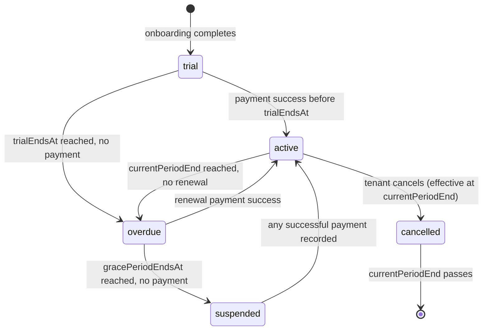
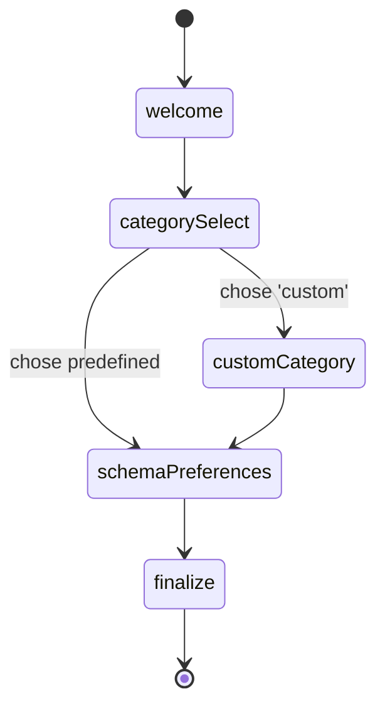
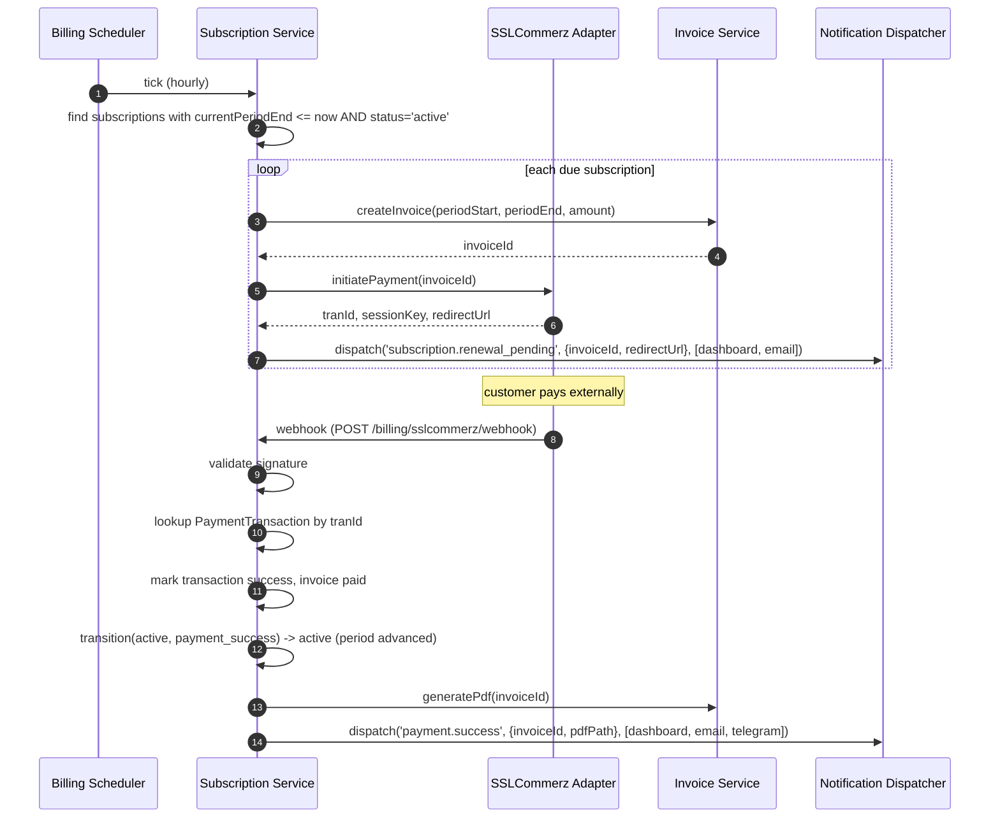

# Design Document

## Overview

This design transforms the existing single-vertical jersey commerce platform into a multi-tenant, category-agnostic AI Commerce Operating System ("Commerce_OS") while preserving every behavior of the live demo tenant `cmooz62gy0000v5gclycwq78p`.

The transformation is driven by three architectural seams:

1. **Reasoning_Context** — every AI turn now receives a fully populated context (`tenantId`, `businessCategory`, `categorySchema`, `agentIdentity`, `brandVoice`, `planLimits`, `workflowRules`) built per-turn by a dedicated builder. The existing `loop.ts` StateGraph stays intact; the builder is injected before `observe_input`.
2. **Category Engine** — a single source of truth for what attributes, terminology, dashboard modules, and workflow rules apply to a tenant. Schemas are stored in `CategorySchema` rows; built-in schemas ship as JSON files. The engine exposes `loadSchema`, `validateProductAttributes`, `validateOrderAttributes`, `resolveTerminology`, `listDashboardModules`, `getWorkflowRules`, `invalidateSchemaCache`. All consumers (admin UIs, agent prompt, form builder, order pipeline) go through this surface.
3. **Subscription + Plan + Feature Flag Plane** — a billing/access plane separate from tenant customer-facing payments. Plans gate features; subscriptions own state transitions; SSLCommerz adapter handles billing; cron drives overdue → suspended transitions; notification dispatcher fans out across adapters.

The design preserves the in-place refactor rule (no `src/agent2/`), the universal storage convention (`sslcommerzTranId`/`sslcommerzSessionKey` for any gateway, `pathaoConsignmentId`/`pathaoMerchantOrderId` for any courier), `prisma db push` only, `bcryptjs`, both admin UIs (legacy `localhost:4000/admin` + Next.js `localhost:3000/admin`), and Banglish-only customer-facing text with terminology resolver so internal terms like "catalog" never leak.

Maps to: R1, R2, R5, R6, R7, R10, R14, R15, R16, R17, R18, R22, R23.

## Architecture

### High-Level Component Diagram

```mermaid
flowchart TB
  subgraph Edge[Edge / Channels]
    FBWebhook[Facebook Messenger Webhook]
    SSLWebhook[SSLCommerz Webhook]
    PathaoWebhook[Pathao/Steadfast Webhook]
    TgWebhook[Telegram Webhook]
  end

  subgraph App[Express App - api.pipwarp.com]
    TenantResolver[Tenant Resolver Middleware]
    SuperAdminAuth[Super_Admin Auth]
    TenantAuth[TenantSession Auth]
  end

  subgraph Plane1[Reasoning Plane]
    RCB[Reasoning_Context Builder]
    Loop[Agent Loop - LangGraph StateGraph]
    Tools[Tool Registry]
    PromptBuilder[buildAgentSystemPrompt]
    ReplyFilter[Reply Filter w/ Terminology Resolver]
    Handoff[Handoff Policy]
  end

  subgraph Plane2[Category Plane]
    CatEngine[Category Engine]
    BuiltIn[Built-in Schemas: jersey/clothing/.../custom]
    SchemaCache[Per-tenant Schema Cache - 30s TTL]
  end

  subgraph Plane3[Identity Plane]
    AgentIdentity[Agent_Identity Service]
    PersonaResolver[Persona Resolver]
  end

  subgraph Plane4[Subscription / Billing Plane]
    SubSvc[Subscription Service]
    BillingScheduler[Billing Scheduler - node-cron]
    SuspensionSvc[Suspension Service]
    GraceSvc[Grace Period Service]
    SSLAdapter[SSLCommerz Subscription Adapter]
    InvoiceSvc[Invoice PDF Service]
  end

  subgraph Plane5[Plan / Feature Flag Plane]
    PlanSvc[Plan Service]
    LimitSvc[Plan Limit Service - usage counters]
    FlagSvc[Feature Flag Service - 30s cache]
  end

  subgraph Plane6[Notification Plane]
    Dispatcher[Notification Dispatcher]
    DashAdapter[Dashboard Adapter]
    EmailAdapter[Email Adapter - 3 retries]
    TgAdapter[Telegram Adapter]
    WAAdapter[(WhatsApp Adapter - future)]
    FBAdapter[(Facebook Adapter - future)]
  end

  subgraph Plane7[Onboarding & Admin]
    OnboardingSvc[Onboarding Service - resumable]
    AdminSvc[Admin Super Control Panel Service]
  end

  subgraph DB[(Postgres - Prisma)]
    TenantTbl[(Tenant)]
    CatTbl[(CategorySchema)]
    PlanTbl[(Plan)]
    SubTbl[(Subscription)]
    InvTbl[(Invoice)]
    TxnTbl[(PaymentTransaction)]
    LogTbl[(SubscriptionLog)]
    NotifTbl[(Notification)]
    ProdTbl[(ProductMapping w/ attributes JSON)]
    OrderTbl[(Order w/ orderAttributes JSON)]
  end

  subgraph UIs[Admin UIs]
    LegacyUI[Legacy localhost:4000/admin - vanilla JS]
    NextUI[Next.js localhost:3000/admin + dashboard.pipwarp.com]
    Wizard[Onboarding Wizard]
    DynForm[DynamicForm Component]
    ModReg[Module Registry]
  end

  FBWebhook --> TenantResolver --> RCB
  RCB --> CatEngine
  RCB --> AgentIdentity
  RCB --> FlagSvc
  RCB --> Loop
  Loop --> Tools
  Loop --> PromptBuilder
  PromptBuilder --> AgentIdentity
  Loop --> ReplyFilter
  ReplyFilter --> CatEngine
  Loop --> Handoff

  CatEngine --> SchemaCache
  CatEngine --> BuiltIn
  CatEngine --> CatTbl

  SSLWebhook --> SSLAdapter --> SubSvc
  BillingScheduler --> SubSvc
  SubSvc --> SuspensionSvc
  SubSvc --> GraceSvc
  SubSvc --> InvoiceSvc
  SubSvc --> Dispatcher
  SubSvc --> SubTbl
  SubSvc --> InvTbl
  SubSvc --> TxnTbl
  SubSvc --> LogTbl

  PlanSvc --> PlanTbl
  LimitSvc --> SubTbl
  FlagSvc --> PlanSvc
  FlagSvc --> SubSvc

  Dispatcher --> DashAdapter --> NotifTbl
  Dispatcher --> EmailAdapter
  Dispatcher --> TgAdapter --> TgWebhook
  Dispatcher --> WAAdapter
  Dispatcher --> FBAdapter

  OnboardingSvc --> CatEngine
  OnboardingSvc --> SubSvc
  OnboardingSvc --> TenantTbl

  AdminSvc --> SubSvc
  AdminSvc --> PlanSvc
  AdminSvc --> CatEngine
  AdminSvc --> LogTbl

  LegacyUI --> App
  NextUI --> App
  Wizard --> OnboardingSvc
  DynForm --> CatEngine
  ModReg --> CatEngine

  Tools --> ProdTbl
  Tools --> OrderTbl
  Tools --> CatEngine
```

Maps to: R1, R2, R3, R4, R6, R7, R10, R11, R12, R13, R15, R16, R17, R18, R19, R20, R21.

### Design Rationale

- **Why a Reasoning_Context builder instead of inlining lookups in the loop?** The existing `loop.ts` is large and stable; inlining tenant/category/plan/identity fetches inside graph nodes would scatter tenant scoping across the file and make tenant isolation hard to audit. A single builder runs once per turn, validates that all required keys are present (Acceptance Criterion R7.6), and hands an immutable object to the graph. Tools read from this object instead of refetching, eliminating duplicate DB hits.

- **Why a Category Engine layer instead of switch-on-category in tools?** Rule R3.6 forbids new physical columns and R7.5 forbids jersey-specific concepts in non-jersey tenants. A category switch in code would re-introduce both. The engine externalizes attributes and rules into JSON schemas; tools become category-agnostic.

- **Why a separate Subscription/Billing plane?** The existing payment integrations (SSLCommerz/AamarPay/bKash) serve tenant *customers*. Tenant *self-billing* needs its own subscription state machine, invoice ledger, and suspension hooks. Mixing the two would conflate access control with order fulfillment. The plane reuses universal columns (`sslcommerzTranId`/`sslcommerzSessionKey` per R14.2) so we don't add gateway-specific fields.

- **Why 30s cache TTL across schema/identity/feature flags?** R2.6, R5.7, R16.5 all require updates to propagate within 30s. A 30s in-process LRU cache with a `lastUpdatedAt` poll is sufficient at single-process scale. The Notification Dispatcher publishes invalidation events that secondary processes (cron worker) listen on via Postgres `LISTEN/NOTIFY`. No Redis dependency added.

- **Why preserve the legacy admin UI?** R23.6 explicitly requires both UIs to stay operational. The legacy UI is the one the operator uses today; ripping it out would block adoption. New endpoints expose the same shape; legacy `app.js` gains category-aware fields incrementally.

## Components and Interfaces

### Folder Structure

```
src/
  agent/
    loop.ts                         (existing - extended)
    prompts.ts                      (existing - extended for category fragments)
    replyFilter.ts                  (existing - terminology pass added)
    handoffPolicy.ts                (existing - unchanged)
    state.ts                        (existing)
    router.ts                       (existing)
    tools/
      registry.ts                   (existing - tools become category-aware)
      ...
    context/
      reasoningContext.ts           NEW - builder + types
      reasoningContextErrors.ts     NEW - MissingTenantScopeError, ReasoningContextIncompleteError
    categoryEngine/
      index.ts                      NEW - public API
      schemaLoader.ts               NEW - loads built-in + DB schemas
      schemaCache.ts                NEW - 30s LRU per tenantId
      validateProductAttributes.ts  NEW
      validateOrderAttributes.ts    NEW
      terminology.ts                NEW - resolveTerminology
      workflowRules.ts              NEW - getWorkflowRules
      invalidation.ts               NEW - LISTEN/NOTIFY via pg
      schemas/
        jersey.json
        clothing.json
        undergarments.json
        shoes.json
        cosmetics.json
        electronics.json
        restaurant.json
        grocery.json
        jewelry.json
        furniture.json
        pet_shop.json
        pharmacy.json
        mobile_accessories.json
        custom.json
    identity/
      agentIdentityService.ts       NEW - persona + tone + language
  services/
    subscription/
      subscriptionService.ts        NEW - state machine
      billingScheduler.ts           NEW - node-cron driver
      suspensionService.ts          NEW - toggles
      gracePeriodService.ts         NEW - day 1/2/3 ladder
      subscriptionStateMachine.ts   NEW - pure transition function
    billing/
      sslcommerzSubscriptionAdapter.ts  NEW
      invoiceService.ts                  (extends existing invoicePdfService)
    plan/
      planService.ts                NEW
      planLimitService.ts           NEW - usage counters + reset on period start
      featureFlagService.ts         NEW - lookup chain + 30s cache
    notifications/
      dispatcher.ts                 NEW
      adapters/
        dashboardChannel.ts         NEW
        emailChannel.ts             NEW - 3 retries exp backoff
        telegramChannel.ts          NEW - wraps telegramService
        whatsappChannel.ts          NEW - stub
        facebookChannel.ts          NEW - stub
      types.ts                      NEW - NotificationChannelAdapter interface
    onboarding/
      onboardingService.ts          NEW - resumable wizard state
    admin/
      adminPanelService.ts          NEW - super-admin operations
      superAdminAuth.ts             NEW - role distinct from TenantSession
    integrations/
      ...                           (existing - unchanged behaviour)
client/
  src/
    app/
      onboarding/
        page.tsx                    NEW - wizard entry
        steps/
          welcome.tsx
          category.tsx
          custom.tsx
          preferences.tsx
          finalize.tsx
      portal/
        ...                         (existing - dashboard becomes module-driven)
      admin/
        ...                         (existing + super-admin views)
    components/
      forms/
        DynamicForm.tsx             NEW - schema-driven form
        DynamicField.tsx            NEW - per-type renderer
      dashboard/
        ModuleRegistry.ts           NEW - moduleId -> component
        modules/
          SizeChart.tsx
          MenuManager.tsx
          ShadeSelector.tsx
          ...
prisma/
  schema.prisma                     EXTENDED - new models, no migrations folder
```

Maps to: R17.1, R17.2, R23.2.

### Reasoning_Context Builder

**File:** `src/agent/context/reasoningContext.ts`

```ts
export interface ReasoningContext {
  readonly tenantId: string;
  readonly businessCategory: string;          // 'jersey' | 'restaurant' | ...
  readonly categorySchema: CategorySchema;     // resolved + cached
  readonly agentIdentity: AgentIdentity;       // name/role/personality/tone/language/salesStyle/greetingStyle
  readonly brandVoice: BrandVoice;             // existing tenant.settings.brandVoice
  readonly planLimits: ResolvedPlanLimits;     // numeric + boolean flags merged with overrides
  readonly workflowRules: WorkflowRules;       // from categorySchema.workflowRules
  readonly subscription: { status: SubscriptionStatus; isOperational: boolean };
}

export async function buildReasoningContext(args: {
  tenantId: string;
  conversationId?: string;
}): Promise<ReasoningContext>;
```

Algorithm:

1. Load tenant by `tenantId`. If missing → throw `MissingTenantScopeError`.
2. Read `tenant.businessCategory` and `tenant.categorySchemaId`. If `categorySchemaId` null → fall back to built-in schema for `businessCategory`; if that is also null → fall back to `jersey` and emit `category_schema_fallback` log (R2.3).
3. Call `categoryEngine.loadCategorySchema(tenantId)` (cached).
4. Call `agentIdentityService.resolve(tenantId, categorySchema)` — merges category defaults over platform defaults, then per-tenant overrides on top (R5.4).
5. Call `planLimitService.resolve(tenantId)` — fetches active subscription and merges per-tenant overrides over plan limits.
6. Read `subscription.status` from `subscriptionService.getStatus(tenantId)`. `isOperational = status in {trial, active}` or (`status=overdue` AND `now < gracePeriodEndsAt`). When `isOperational=false`, downstream tools refuse to send outbound messages (R12.4).
7. Validate that `tenantId`, `businessCategory`, `categorySchema` are all present; otherwise throw `ReasoningContextIncompleteError` (R7.6).
8. Return frozen object.

The existing `askRouter` path in `src/agent/router.ts` already fetches tenant settings per turn. The builder wraps that fetch and adds the category/plan/identity layers. `loop.ts` accepts the context as an additional input on `AgentTurnInput.reasoningContext` and passes it to every tool via `ToolHandlerCtx`.

Maps to: R5, R6, R7, R18.1, R18.2.

### Category Engine

**File:** `src/agent/categoryEngine/index.ts`

Public API:

```ts
export async function loadCategorySchema(tenantId: string): Promise<CategorySchema>;
export async function validateProductAttributes(
  tenantId: string, attributes: Record<string, unknown>
): Promise<{ ok: true } | { ok: false; errors: ValidationError[] }>;
export async function validateOrderAttributes(
  tenantId: string, orderAttributes: Record<string, unknown>
): Promise<{ ok: true } | { ok: false; errors: ValidationError[] }>;
export function resolveTerminology(tenantId: string, internalTerm: string): Promise<string>;
export async function listDashboardModules(tenantId: string): Promise<DashboardModuleId[]>;
export async function getWorkflowRules(tenantId: string): Promise<WorkflowRules>;
export function invalidateSchemaCache(tenantId: string): void;
```

`CategorySchema` shape (also stored as JSON in the `CategorySchema` table):

```ts
interface CategorySchema {
  id: string;                          // 'jersey-builtin' | 'cosmetics-builtin' | tenant-clone id
  slug: string;                        // 'jersey' | 'cosmetics' | ...
  version: number;                     // bumped on tenant edits
  attributes: AttributeField[];        // product fields
  variantAttributes: AttributeField[]; // variant fields
  orderAttributes: AttributeField[];   // order-time fields
  filterAttributes: AttributeField[];  // dashboard filter fields
  terminology: Record<string, string>; // 'catalog' -> 'product list', 'cart' -> 'order list', ...
  dashboardModules: string[];          // ['size_chart', 'team_filter', 'product_grid', ...]
  workflowRules: WorkflowRules;        // category-specific reasoning hints
  promptFragments: string[];           // appended to system prompt after persona
  isBuiltIn: boolean;
  tenantId: string | null;             // non-null for tenant-cloned customizations
}

interface AttributeField {
  key: string;                         // e.g. 'chest', 'spice_level', 'shoe_size'
  label: string;                       // display label
  type: 'string'|'number'|'boolean'|'enum'|'multi_enum'|'date'|'currency'|'image_ref';
  required: boolean;
  customerVisible: boolean;            // when true, terminology-translated value is included in customer replies
  enumValues?: string[];
  min?: number;
  max?: number;
  unit?: string;                       // 'cm', 'BDT', 'min'
}
```

Cache: per-`tenantId` LRU with 30s TTL. On schema write the service emits a `pg_notify('category_schema_invalidate', tenantId)`. Each Node process subscribes and evicts the cached entry. Maps to R2.6.

Validation rules (R3.2, R8.2):

- Reject unknown keys.
- Reject missing required fields (when not in legacy preserve-mode for jersey demo).
- Type-check by `field.type` (e.g. `enum` value must be in `enumValues`, `currency` must parse as number, `number` honors `min`/`max`).
- `validateProductAttributes` returns errors as `[{ key, code: 'unknown_key' | 'missing_required' | 'type_mismatch' | 'enum_violation', detail? }]`.

`resolveTerminology` always passes through the active schema's `terminology` map. The Reply Filter calls it before sending replies, replacing internal terms (e.g. `catalog`, `cart`, `SKU`) with Banglish customer-facing words. This ensures the existing rule "never expose 'catalog' to customers" is enforced centrally rather than scattered across prompts. Maps to R2.5, R18.7.

#### Built-in Schemas (sample shapes)

- **jersey:** `attributes` = `chest, length, sleeve, version, team, season`; `orderAttributes` = `size, version, name_print, number_print`; `dashboardModules` = `size_chart, team_filter, player_filter, product_grid, orders_table, conversations_panel`. Preserves all current jersey behavior.
- **restaurant:** `attributes` = `food_category, prep_time, portion_size`; `orderAttributes` = `spice_level, toppings, delivery_notes`; `dashboardModules` = `menu_manager, delivery_zones, food_variants, orders_table, conversations_panel`.
- **cosmetics:** `attributes` = `shade, skin_type, ingredients, volume`; `orderAttributes` = `shade, gift_wrap`; `dashboardModules` = `shade_selector, skin_type_filter, ingredients_panel, product_grid`.
- **shoes:** `attributes` = `shoe_size, gender, sole_type, width`; `orderAttributes` = `shoe_size, color`; `dashboardModules` = `shoe_size_chart, gender_filter, product_grid`.
- **electronics:** `attributes` = `model, brand, specs, warranty_months`; `orderAttributes` = `model, warranty_choice, accessories`; `dashboardModules` = `specs_panel, compatibility_check, product_grid`.
- **custom:** empty `attributes`/`orderAttributes`; tenant fills via wizard.

The remaining categories follow the same pattern. Maps to R2.4.

### Agent Identity Service

**File:** `src/agent/identity/agentIdentityService.ts`

```ts
export interface AgentIdentity {
  name: string;            // existing botPersona.name, default 'Karim'
  role: string;            // existing botPersona.role, default 'Moderator of this Page'
  personality: string;     // 'warm, concise, friendly'
  tone: string;            // 'banglish_warm' | 'english_formal' | ...
  language: string;        // 'bn-BD' | 'en' | future
  salesStyle: string;      // 'consultative' | 'high_energy' | 'low_pressure'
  greetingStyle: string;   // 'casual' | 'formal'
}

export async function resolve(
  tenantId: string, schema: CategorySchema
): Promise<AgentIdentity>;
```

Resolution chain (R5.2, R5.4):

1. Read `tenant.agentIdentity` JSON column (new field). If a key is set, use it.
2. For unset keys, read `categorySchema.agentIdentityDefaults` (new schema field, optional).
3. Fall back to platform defaults (`Karim`, `Moderator of this Page`, `warm, concise`, `banglish_warm`, `bn-BD`, `consultative`, `casual`).

The existing `resolvePersonaIdentity()` and `buildAgentSystemPrompt()` in `prompts.ts` are kept for backward compatibility; they're updated to accept the full `AgentIdentity` and inject `personality`, `tone`, `language`, `salesStyle`, `greetingStyle` into the prompt template after the existing `{{personaName}}`/`{{personaRole}}` placeholders. The placeholder semantics are unchanged. Maps to R5, R19.2.

### Subscription Service & State Machine

**Files:** `src/services/subscription/subscriptionService.ts`, `subscriptionStateMachine.ts`



State transitions are encoded in a pure function `transition(current, event): next` covering events `onboarding_complete`, `payment_success`, `payment_failure`, `period_end_reached`, `grace_period_end_reached`, `tenant_cancel`, `super_admin_reactivate`, `super_admin_force_suspend`. Every transition writes a `SubscriptionLog` row with `fromStatus`, `toStatus`, `reason`, `actor` (`'system' | 'super_admin:<id>' | 'tenant:<id>'`). Maps to R10, R12.7.

Day-by-day warning ladder (driven by `gracePeriodService` running on a 1-hour cron):

- T+0h after entering `overdue`: send first overdue warning.
- T+24h: send second warning.
- T+48h: send final warning.
- T+72h (`gracePeriodEndsAt`): transition to `suspended`, run suspension actions.

Each warning writes a `GracePeriodTracking` row with `(subscriptionId, day, warningSentAt, channel)` so we never double-send if the cron fires twice. Maps to R12.1, R12.2, R12.3.

### Suspension Service

**File:** `src/services/subscription/suspensionService.ts`

When `transition(...) -> suspended`, run actions in order:

1. Set `tenant.isActive = false` (existing column, reused).
2. Disable the AI agent on the tenant's Facebook page: webhook handler checks `subscription.isOperational` before invoking the agent loop. If false, the inbound message is logged but no reply is sent.
3. Pause autonomous AI posting: `contentAgentService` checks `isOperational` before each scheduled tick.
4. Pause outbound messaging: any non-agent outbound (follow-ups, scheduled posts) refuses with `subscription_suspended` error.
5. Storefront deactivation: any tenant-public read endpoint (if present) returns 503 with reactivation note.
6. Preserve all data: NO deletes, NO anonymization. Conversations, products, AI memory, schemas remain intact (R12.5).

Reactivation (`transition(...) -> active` from `suspended`):

1. Set `tenant.isActive = true`.
2. Re-enable webhook handling, posting, outbound messaging within 5 minutes (the cache holds `isOperational` for at most that window) (R12.6).
3. Send reactivation notification via dispatcher.

Maps to R12.

### SSLCommerz Subscription Adapter

**File:** `src/services/billing/sslcommerzSubscriptionAdapter.ts`

Two flows:

- **Initiate session** for a renewal or first-time payment. Creates a `PaymentTransaction` row with `status='pending'` and stores `sslcommerzTranId`/`sslcommerzSessionKey`. Returns redirect URL.
- **Webhook handler** at `POST /api/v1/billing/sslcommerz/webhook`. Steps:
  1. Validate signature against SSLCommerz store secret. On failure: respond 400, log `payment_webhook_signature_invalid` (R11.6).
  2. Look up `PaymentTransaction` by `tranId`. If not found: respond 200, log `payment_webhook_unmatched` (R11.5).
  3. If `status` already terminal (`success` or `failed`): respond 200 (idempotent).
  4. On success: mark transaction `status='success'`, mark linked `Invoice` `status='paid'`, store invoice PDF reference, dispatch `subscription_payment_success` event to `subscriptionService` which invokes `transition(currentStatus, payment_success)`. Generate invoice PDF via existing `invoicePdfService` extension. Queue email + dashboard notification.
  5. On failure: mark transaction `status='failed'`, write `PaymentFailure` row with reason, do NOT change subscription status (handled by grace period cron).

The webhook is mounted via existing CORS-aware Express setup. Body is read raw for signature validation. Maps to R11.

### Plan Service & Plan Limit Service

**Files:** `src/services/plan/planService.ts`, `planLimitService.ts`

Plans seeded (idempotent on bootstrap):

| Slug | Display | Cycle | Trial Days | Notable Limits |
|---|---|---|---|---|
| `starter` | Starter | monthly | 14 | maxMonthlyMessages=2k, maxProducts=50, maxSocialAccounts=1, aiPostingEnabled=false |
| `pro` | Pro | monthly | 14 | maxMonthlyMessages=20k, maxProducts=500, maxSocialAccounts=3, aiPostingEnabled=true |
| `agency` | Agency | monthly | 14 | maxMonthlyMessages=100k, maxProducts=5000, maxSocialAccounts=10, aiPostingEnabled=true, automationRulesEnabled=true |
| `enterprise` | Enterprise | monthly | 0 | unlimited (-1), all flags true |

`Plan.limits` is JSON. `Plan.featureFlags` is JSON. Numeric `-1` means unlimited.

`planLimitService` exposes:

```ts
async function checkLimit(tenantId: string, key: string, requestedDelta?: number): Promise<{ ok: true } | { ok: false; current: number; max: number }>;
async function incrementUsage(tenantId: string, key: 'messages'|'aiTokens'|'posts', delta: number): Promise<void>;
async function resetUsageCounters(tenantId: string): Promise<void>; // called on currentPeriodStart
```

Usage counters are stored on the `Subscription` row (`usageCounters` JSON) to avoid a separate table for now. They reset when `subscriptionService` advances `currentPeriodStart`. Maps to R15.5.

Per-tenant overrides (R15.6) live on `Subscription.planLimitOverrides` JSON. The lookup chain is `override → Plan.limits → platform default`.

### Feature Flag Service

**File:** `src/services/plan/featureFlagService.ts`

```ts
async function featureFlag(tenantId: string, flagKey: string): Promise<boolean>;
```

Lookup chain: tenant override on `Subscription.planLimitOverrides[flagKey]` → `Plan.featureFlags[flagKey]` → platform default (`false`).

Cache: per-`tenantId` map with 30s TTL. Invalidation via `pg_notify('feature_flag_invalidate', tenantId)`. Maps to R16.5.

Predefined flags (R16.2):

- `feature.aiPosting`
- `feature.contentCalendar`
- `feature.automationRules`
- `feature.multiSocialAccounts`
- `feature.advancedAnalytics`
- `feature.customCategorySchema`

When a numeric limit is hit, an API call returns:

```json
{ "error": "plan_limit_exceeded", "limitKey": "maxProducts", "current": 500, "max": 500 }
```

The Next.js admin UI catches this and renders an upgrade prompt. Maps to R15.3, R15.4, R16.3.

### Notification Dispatcher & Adapters

**File:** `src/services/notifications/dispatcher.ts`

```ts
export interface NotificationChannelAdapter {
  readonly id: 'dashboard'|'email'|'telegram'|'whatsapp'|'facebook';
  send(input: { tenantId: string; type: string; payload: unknown }): Promise<{ ok: boolean; reason?: string }>;
}

export async function dispatch(input: {
  tenantId: string;
  channels: NotificationChannelAdapter['id'][];
  type: string;     // 'subscription.overdue.day1' | 'subscription.suspended' | 'payment.success' | ...
  payload: unknown;
}): Promise<void>;
```

`dispatch` writes a `Notification` row per channel with `status='queued'`, then invokes each adapter:

- `dashboardChannel.send` simply marks the row `status='delivered'`. The dashboard reads unread rows.
- `emailChannel.send` calls existing email transport. On failure, retries 3 times with exponential backoff (1s, 4s, 16s). After final failure, mark `status='failed'` (R13.5).
- `telegramChannel.send` wraps existing `telegramService.sendTelegramMessage` (and `sendTelegramDocument` for invoice PDFs). Preserves existing inline-button behavior for manual payment alerts (R13.6).
- `whatsappChannel.send`, `facebookChannel.send` are stubs that return `{ ok: false, reason: 'not_implemented' }` until real adapters land. The dispatcher hides their feature toggles in the dashboard until then (R21.4).

Maps to R13.

### Onboarding Service & Wizard

**File:** `src/services/onboarding/onboardingService.ts`

State machine:



Persistence: each completed step writes `tenant.onboardingState = { lastCompletedStep, payload }` JSON (R1.7). Resume reads the JSON on dashboard load and routes to the next step.

On `finalize` (single transaction):

1. Set `tenant.businessCategory`, `tenant.businessSubcategory`, `tenant.dashboardTemplate`.
2. If predefined category: link `tenant.categorySchemaId` to the built-in `CategorySchema` row.
3. If custom: clone the closest built-in into a new `CategorySchema` row with `tenantId` set, apply user edits, link.
4. Call `subscriptionService.startTrial(tenantId, planSlug)` which creates a `Subscription` with `status='trial'`, `trialEndsAt = now + plan.trialDays` (default 14, R10.3).
5. Set `tenant.onboardingCompletedAt = now`.

Demo tenant special case (R1.8, R22.1): seed migration sets `businessCategory='jersey'`, `categorySchemaId=jersey-builtin`, `onboardingCompletedAt=migrationTimestamp` so the wizard never runs.

Wizard UI lives in `client/src/app/onboarding/`. Each step is a Next.js page. Middleware in `client/src/middleware.ts` redirects to `/onboarding` when `tenant.onboardingCompletedAt` is null (R1.1).

Maps to R1.

### Admin Super Control Panel

**File:** `src/services/admin/adminPanelService.ts`

Routes (all under `/api/v1/admin/*`, gated by `superAdminAuth.requireSuperAdmin`):

- `GET /admin/tenants` — list with `tenantId, name, businessCategory, planId, subscriptionStatus, currentPeriodEnd, lastPaymentStatus`.
- `GET /admin/tenants/:id` — full tenant detail.
- `POST /admin/subscriptions/:id/suspend` — manual suspension.
- `POST /admin/subscriptions/:id/reactivate` — manual reactivation, logs `manual_reactivation`.
- `POST /admin/subscriptions/:id/cancel`.
- `POST /admin/subscriptions/:id/override-limits` — set `planLimitOverrides` JSON.
- `GET /admin/payments` — `payment_transactions` + `payment_failures` filterable.
- `GET /admin/usage/:tenantId` — current period usage vs limits.
- `GET /admin/categories` — list `CategorySchema` rows.
- `POST /admin/categories` / `PATCH /admin/categories/:id` — manage schemas.
- `POST /admin/tenants/:id/category` — assign schema to tenant.

`Super_Admin` is a role distinct from `TenantSession` (R20.7). Implemented as a separate `SuperAdminSession` model (mirrors `TenantSession` shape, no `tenantId`). Every super-admin-scoped tenant operation requires explicit `tenantId` parameter; calls without it are denied at the controller level. Every action writes `SubscriptionLog` (or a parallel audit trail for non-subscription actions). Maps to R20, R6.5.

### Future-Ready Adapter Interfaces

```ts
// src/services/messaging/messagingChannelAdapter.ts
export interface MessagingChannelAdapter {
  readonly id: 'messenger'|'whatsapp'|'voice';
  receive(): Promise<InboundMessage>;          // implementation per channel
  send(tenantId: string, recipientId: string, text: string): Promise<{ ok: boolean }>;
}

// src/services/marketplace/marketplaceAdapter.ts
export interface MarketplaceAdapter {
  readonly id: 'shopify'|'daraz';
  syncProducts(tenantId: string): Promise<{ added: number; updated: number }>;
  pushOrder(tenantId: string, orderId: string): Promise<{ ok: boolean; externalId?: string }>;
}

// src/services/media/mediaGenerationAdapter.ts
export interface MediaGenerationAdapter {
  readonly id: 'image_ad'|'video_ad';
  generate(tenantId: string, brief: MediaBrief): Promise<MediaResult>;
}
```

Maps to R21.

## Data Models

All deltas applied via `prisma db push` only (R14.3, R23.3). No migrations folder. New models below use JSON columns for category-specific data and reuse universal columns.

### Tenant (additions)

```prisma
model Tenant {
  // ... existing fields ...
  businessCategory      String?    // 'jersey' | 'restaurant' | 'custom' | ...
  businessSubcategory   String?
  categorySchemaId      String?
  dashboardTemplate     String?    // 'jersey' | 'restaurant' | ...
  onboardingCompletedAt DateTime?
  onboardingState       Json?      // { lastCompletedStep, payload }
  agentIdentity         Json?      // { name, role, personality, tone, language, salesStyle, greetingStyle }

  categorySchema        CategorySchema? @relation(fields: [categorySchemaId], references: [id])
  subscription          Subscription?
  notifications         Notification[]
  invoices              Invoice[]
  paymentTransactions   PaymentTransaction[]
  subscriptionLogs      SubscriptionLog[]
  paymentFailures       PaymentFailure[]
}
```

### CategorySchema

```prisma
model CategorySchema {
  id                String   @id @default(cuid())
  slug              String
  version           Int      @default(1)
  attributes        Json     // AttributeField[]
  variantAttributes Json
  orderAttributes   Json
  filterAttributes  Json
  terminology       Json     // Record<string,string>
  dashboardModules  Json     // string[]
  workflowRules     Json
  promptFragments   Json     // string[]
  isBuiltIn         Boolean  @default(false)
  tenantId          String?  // null for built-ins; set for tenant-cloned customizations
  createdAt         DateTime @default(now())
  updatedAt         DateTime @updatedAt

  tenants           Tenant[]

  @@index([slug])
  @@index([tenantId])
}
```

### Plan, Subscription, Invoice, PaymentTransaction

```prisma
model Plan {
  id            String   @id @default(cuid())
  slug          String   @unique  // 'starter' | 'pro' | 'agency' | 'enterprise'
  displayName   String
  billingCycle  String   @default("monthly")
  priceBdt      Decimal  @db.Decimal(12, 2)
  trialDays     Int      @default(14)
  limits        Json     // { maxMonthlyMessages, maxAiTokensMonthly, maxProducts, maxSocialAccounts, maxPostingPerDay }
  featureFlags  Json     // { 'feature.aiPosting': bool, ... }
  isActive      Boolean  @default(true)
  createdAt     DateTime @default(now())
  updatedAt     DateTime @updatedAt

  subscriptions Subscription[]
}

model Subscription {
  id                    String    @id @default(cuid())
  tenantId              String    @unique
  tenant                Tenant    @relation(fields: [tenantId], references: [id], onDelete: Cascade)
  planId                String
  plan                  Plan      @relation(fields: [planId], references: [id])
  status                String    // 'trial' | 'active' | 'overdue' | 'suspended' | 'cancelled'
  trialEndsAt           DateTime?
  currentPeriodStart    DateTime
  currentPeriodEnd      DateTime
  gracePeriodEndsAt     DateTime?
  cancelledAt           DateTime?
  nextBillingAt         DateTime?
  billingCycle          String    @default("monthly")
  planLimitOverrides    Json?     // per-tenant override map
  usageCounters         Json?     // { messages: 0, aiTokens: 0, posts: 0 }
  createdAt             DateTime  @default(now())
  updatedAt             DateTime  @updatedAt

  invoices              Invoice[]
  gracePeriodTrackings  GracePeriodTracking[]

  @@index([status])
  @@index([currentPeriodEnd])
  @@index([gracePeriodEndsAt])
}

model Invoice {
  id                   String   @id @default(cuid())
  subscriptionId       String
  subscription         Subscription @relation(fields: [subscriptionId], references: [id], onDelete: Cascade)
  tenantId             String
  tenant               Tenant   @relation(fields: [tenantId], references: [id], onDelete: Cascade)
  periodStart          DateTime
  periodEnd            DateTime
  amountBdt            Decimal  @db.Decimal(12, 2)
  currency             String   @default("BDT")
  status               String   // 'pending' | 'paid' | 'failed' | 'cancelled'
  pdfPath              String?
  sslcommerzTranId     String?  // universal gateway tran id
  sslcommerzSessionKey String?
  createdAt            DateTime @default(now())
  updatedAt            DateTime @updatedAt

  paymentTransactions  PaymentTransaction[]

  @@index([tenantId])
  @@index([status])
}

model PaymentTransaction {
  id                   String   @id @default(cuid())
  invoiceId            String
  invoice              Invoice  @relation(fields: [invoiceId], references: [id], onDelete: Cascade)
  tenantId             String
  tenant               Tenant   @relation(fields: [tenantId], references: [id], onDelete: Cascade)
  gateway              String   // 'sslcommerz' (subscription billing default)
  amountBdt            Decimal  @db.Decimal(12, 2)
  status               String   // 'pending' | 'success' | 'failed'
  sslcommerzTranId     String?  @unique
  sslcommerzSessionKey String?
  rawPayload           Json?
  createdAt            DateTime @default(now())
  updatedAt            DateTime @updatedAt

  paymentFailures      PaymentFailure[]

  @@index([tenantId])
  @@index([status])
}

model SubscriptionLog {
  id          String   @id @default(cuid())
  tenantId    String
  tenant      Tenant   @relation(fields: [tenantId], references: [id], onDelete: Cascade)
  fromStatus  String?
  toStatus    String
  reason      String
  actor       String   // 'system' | 'super_admin:<id>' | 'tenant:<id>'
  metadata    Json?
  createdAt   DateTime @default(now())

  @@index([tenantId, createdAt])
}

model PaymentFailure {
  id            String   @id @default(cuid())
  tenantId      String
  tenant        Tenant   @relation(fields: [tenantId], references: [id], onDelete: Cascade)
  transactionId String?
  transaction   PaymentTransaction? @relation(fields: [transactionId], references: [id])
  reason        String
  rawPayload    Json?
  createdAt     DateTime @default(now())

  @@index([tenantId, createdAt])
}

model GracePeriodTracking {
  id              String   @id @default(cuid())
  subscriptionId  String
  subscription    Subscription @relation(fields: [subscriptionId], references: [id], onDelete: Cascade)
  tenantId        String
  day             Int      // 0 (entry) | 1 | 2
  warningSentAt   DateTime @default(now())
  channel         String   // 'dashboard' | 'email' | 'telegram'

  @@unique([subscriptionId, day, channel])
}

model Notification {
  id        String   @id @default(cuid())
  tenantId  String
  tenant    Tenant   @relation(fields: [tenantId], references: [id], onDelete: Cascade)
  channel   String   // 'dashboard' | 'email' | 'telegram' | 'whatsapp' | 'facebook'
  type      String
  payload   Json
  status    String   // 'queued' | 'delivered' | 'failed'
  attempts  Int      @default(0)
  createdAt DateTime @default(now())
  sentAt    DateTime?
  readAt    DateTime?

  @@index([tenantId, createdAt])
  @@index([tenantId, status])
}

model SuperAdminSession {
  id            String   @id @default(cuid())
  superAdminId  String
  tokenHash     String   @unique
  expiresAt     DateTime
  ip            String?
  userAgent     String?
  createdAt     DateTime @default(now())
  lastSeen      DateTime @default(now())

  @@index([superAdminId])
  @@index([expiresAt])
}

model SuperAdmin {
  id           String   @id @default(cuid())
  email        String   @unique
  passwordHash String   // bcryptjs (R23.5)
  name         String?
  isActive     Boolean  @default(true)
  createdAt    DateTime @default(now())
  updatedAt    DateTime @updatedAt
}
```

### ProductMapping & Order (extensions)

`ProductMapping.metadata` JSON already exists; the design formalizes the `attributes` sub-key:

```jsonc
// ProductMapping.metadata
{
  "attributes": { "chest": 42, "length": 28, "team": "Argentina", "version": "fan", "season": "2024" },
  "compareAtPrice": 1700,
  "saleStartsAt": "...",
  "saleEndsAt": "..."
}
```

`Order.structuredData` JSON already exists; the design formalizes the `orderAttributes` sub-key:

```jsonc
// Order.structuredData
{
  "items": [...],
  "orderAttributes": { "size": "L", "color": "blue", "fit": "regular" }
}
```

No new physical columns added (R3.1, R3.6, R8.1, R14.6). Universal columns `sslcommerzTranId`, `sslcommerzSessionKey`, `pathaoConsignmentId`, `pathaoMerchantOrderId` on `Order` are kept and reused for all gateways/couriers (R8.6, R14.2, R22.4, R22.5).

Backfill plan for demo tenant (R3.3, R22.1, R22.2): a one-time script reads existing jersey columns where present, writes them into `metadata.attributes`, and leaves originals intact for read fallback. The Category Engine validator runs in a "preserve mode" for `businessCategory=jersey` so legacy keys never fail validation.

Maps to R3, R8, R14, R22.

## Error Handling

### Tenant Isolation Violations

`MissingTenantScopeError` and `tenant_isolation_violation` event:

- Tools that touch `prisma` MUST receive `tenantId` from `ToolHandlerCtx`. The registry wraps each tool handler with a guard that throws `MissingTenantScopeError` if `ctx.tenantId` is falsy.
- The Reasoning_Context builder fails fast if `tenantId` is missing.
- Webhook handlers (Messenger, SSLCommerz, Pathao, Steadfast, Telegram) MUST resolve `tenantId` before any tenant-scoped read (R6.6).
- Cache keys for schema, identity, plan limits, feature flags, reply filter all include `tenantId` as a prefix (R6.4).

Maps to R6.

### Reasoning Context Incompleteness

When the builder cannot populate `tenantId`, `businessCategory`, or `categorySchema`, it throws `ReasoningContextIncompleteError`. The agent loop catches it before `observe_input` and short-circuits to a hand-off path (mute conversation 10h, send Telegram alert) instead of producing a reply. Maps to R7.6.

### Subscription Suspension Paths

Outbound surfaces (Messenger reply, content publish, follow-up send) check `reasoningContext.subscription.isOperational`. When false:

- Messenger inbound: log only, no reply.
- Scheduled posts: skip with `subscription_suspended` failure reason.
- Follow-ups: status becomes `cancelled` with reason `subscription_suspended`.

Maps to R12.4.

### Payment Webhook Edge Cases

- Unmatched `tranId`: 200 OK + log `payment_webhook_unmatched` (R11.5).
- Invalid signature: 400 + log `payment_webhook_signature_invalid` (R11.6).
- Duplicate webhook (idempotent): tx already terminal → 200 OK, no state change.

### Plan Limit Errors

API returns structured 402 (Payment Required) error:

```json
{ "error": "plan_limit_exceeded", "limitKey": "maxProducts", "current": 500, "max": 500 }
```

The Next.js admin UI catches and renders an upgrade prompt (R15.3).

### Reply Filter & Banglish Enforcement

The existing `replyFilter.ts` (with five override kinds) gains a `terminology` pass that runs before `banned_word`. This pass replaces internal terms (e.g. `catalog`, `cart`, `select`) with the active schema's `terminology` map values (e.g. `product list`, `order list`, `bechte nin`). Banglish-only enforcement remains downstream. Maps to R18.7, R22.7.

## Correctness Properties

These executable properties are the formal specification the implementation must uphold. They drive property-based tests in the task plan and serve as the contract for safe refactoring.

### Property 1: Tenant Scope Invariant

**Statement:** Every read or write against a tenant-scoped table includes a non-empty `tenantId` filter.

**Encoding:** For any tool invocation `t` with `ctx.tenantId == null`, `runTool(t, ctx)` throws `MissingTenantScopeError`. For any Prisma query reaching `Order|ProductMapping|MessengerConversation|MessengerMessage|CustomerProfile|FollowUp|AgentTrace|KnowledgeExample|ScheduledPost|Subscription|Invoice|PaymentTransaction|SubscriptionLog|PaymentFailure|GracePeriodTracking|Notification|CategorySchema(tenantId not null)`, the `where` clause includes `tenantId`.

**Validates: Requirements 6.1, 6.2, 6.3**

### Property 2: Reasoning Context Completeness

**Statement:** No AI reasoning cycle runs with an incomplete context.

**Encoding:** For any `runAgentTurn(input)`, either the loop produces a reply with `input.reasoningContext.{tenantId, businessCategory, categorySchema}` all non-null, or it throws `ReasoningContextIncompleteError` and emits no Messenger send.

**Validates: Requirements 7.1, 7.6, 18.1**

### Property 3: Category Schema Determinism

**Statement:** Validation is a pure function of `(tenantId, attributes, schemaVersion)`.

**Encoding:** For any `tenantId, attributes, schemaVersion`, repeated calls to `validateProductAttributes` and `validateOrderAttributes` return identical results within a single schema version. Cache invalidation only occurs when `schemaVersion` changes via tenant edit.

**Validates: Requirements 2.6, 3.2, 8.2, 9.3**

### Property 4: Subscription State Machine Soundness

**Statement:** State transitions are total and deterministic over the defined event set.

**Encoding:** For every `(currentStatus, event)` in `{trial, active, overdue, suspended, cancelled} × {onboarding_complete, payment_success, payment_failure, period_end_reached, grace_period_end_reached, tenant_cancel, super_admin_reactivate, super_admin_force_suspend}`, `transition(currentStatus, event)` returns either a defined next status or a typed `IllegalTransition` error. No transition is silently dropped, and every successful transition writes exactly one `SubscriptionLog` row.

**Validates: Requirements 10.2, 10.4, 10.5, 10.6, 10.7, 12.7**

### Property 5: Webhook Idempotency

**Statement:** Replaying a previously-processed payment webhook does not change subscription or invoice state.

**Encoding:** For any sequence `[w, w]` of identical SSLCommerz webhook deliveries with the same `tranId`, the database state after the second delivery equals the state after the first. Unmatched `tranId` returns 200; invalid signature returns 400 without state change.

**Validates: Requirements 11.2, 11.5, 11.6**

### Property 6: Suspension Preserves Data

**Statement:** Transitioning to `suspended` does not delete or anonymize tenant-scoped rows.

**Encoding:** For any `tenantId`, `rowCount(table, tenantId)` after suspension equals `rowCount(table, tenantId)` before suspension for every tenant-scoped table. Only `tenant.isActive` and feature toggles change.

**Validates: Requirements 12.5**

### Property 7: Plan Limit Lookup Chain Order

**Statement:** Per-tenant overrides take precedence over plan limits, which take precedence over platform defaults.

**Encoding:** For any `(tenantId, key)`, `resolveLimit(tenantId, key)` returns the first non-null value in the sequence `[Subscription.planLimitOverrides[key], Plan.limits[key], platformDefault[key]]`.

**Validates: Requirements 15.6, 16.1**

### Property 8: Banglish Customer-Facing Text

**Statement:** No customer-facing reply contains internal terminology keys.

**Encoding:** For any reply `r` produced by the agent loop and passed through the reply filter, `r` does not contain any string in `internalTerminologyKeys` (`'catalog'`, `'cart'`, `'select'`, `'checkout'`, `'sku'`) outside of values defined in the active schema's `terminology` map.

**Validates: Requirements 18.7, 22.7**

### Property 9: Onboarding Resumability

**Statement:** Closing the browser at any wizard step preserves progress.

**Encoding:** For any sequence of completed steps `[s1, ..., sk]` where `sk < finalize`, on next login the wizard resumes at step `sk+1` with all prior payloads intact.

**Validates: Requirements 1.7**

### Property 10: Tenant Cache Key Isolation

**Statement:** Cached values for tenant A are never returned to tenant B.

**Encoding:** For any cache `c` in `{schemaCache, identityCache, planLimitCache, featureFlagCache, replyFilterCache}` and any `(tenantA, tenantB)` with `tenantA != tenantB`, `c.get(tenantA)` and `c.get(tenantB)` operate on disjoint keys.

**Validates: Requirements 6.4**

These properties are the basis for the property-based test suite in the task plan.

## Testing Strategy

### Unit Tests (preserve existing tsx-runnable IIFE pattern, R23.9)

- `categoryEngine/validateProductAttributes.test.ts` — unknown key, missing required, type mismatch, enum violation, jersey preserve mode.
- `categoryEngine/terminology.test.ts` — terminology map application, fallback when key absent.
- `categoryEngine/schemaCache.test.ts` — 30s TTL, `pg_notify` invalidation eviction.
- `subscription/subscriptionStateMachine.test.ts` — every transition in the diagram, cancellation deferral until period end, suspension preserves data.
- `subscription/gracePeriodService.test.ts` — Day 0/1/2 warning ladder, no double-send via `GracePeriodTracking` unique constraint.
- `billing/sslcommerzSubscriptionAdapter.test.ts` — signed/unsigned, matched/unmatched tranId, idempotent re-delivery.
- `plan/featureFlagService.test.ts` — override > plan > default chain, 30s cache invalidation.
- `notifications/dispatcher.test.ts` — multi-channel fan-out, email retry with backoff, Telegram inline buttons preserved.
- `onboarding/onboardingService.test.ts` — resume after each step, atomic finalize, demo tenant skip path.
- `agent/context/reasoningContext.test.ts` — incomplete context throws, fallback chain for missing schema.
- `agent/identity/agentIdentityService.test.ts` — resolution chain (tenant → category → platform).

### Integration Tests

- End-to-end onboarding flow (jersey, restaurant, custom).
- Subscription lifecycle (trial → active → overdue → suspended → reactivated).
- Inbound Messenger turn for non-jersey tenant verifying no jersey-specific concepts leak (R7.5).

### Test Conventions Preserved

- Test files are tsx-runnable, IIFE-wrapped.
- Prisma stubs in `installStubs`/`restoreStubs`.
- Axios stub installed before `loop.ts` import.
- `psid: "SIM_..."` short-circuits Messenger sends.
- Run via `Get-ChildItem src\agent\__tests__\*.test.ts | foreach { npx tsx $_.FullName }` and a sibling sweep for new `src/services/__tests__/`.

Maps to R23.9, R18.5.

## Sequence Diagrams

### Inbound Messenger Turn (Multi-Tenant)

```mermaid
sequenceDiagram
  autonumber
  participant FB as Facebook Webhook
  participant Mw as Tenant Resolver
  participant RCB as Reasoning_Context Builder
  participant CE as Category Engine
  participant AI as Agent_Identity Service
  participant Plan as Plan/Flag Service
  participant Loop as Agent Loop
  participant RF as Reply Filter
  participant Send as Messenger Send

  FB->>Mw: POST /webhook/facebook (pageId, psid, text)
  Mw->>Mw: resolve tenantId from pageId
  Mw->>RCB: buildReasoningContext({tenantId})
  RCB->>CE: loadCategorySchema(tenantId)
  CE-->>RCB: schema (cached or DB)
  RCB->>AI: resolve(tenantId, schema)
  AI-->>RCB: agentIdentity
  RCB->>Plan: resolvePlanLimits(tenantId)
  Plan-->>RCB: limits + flags
  RCB-->>Mw: ReasoningContext (frozen)
  alt subscription not operational
    Mw->>Mw: log inbound, no reply
  else operational
    Mw->>Loop: runAgentTurn({input, reasoningContext})
    Loop->>Loop: 10-stage StateGraph
    Loop->>RF: applyTerminology + bannedWord + tone + capabilityConfession + confirmationBlock
    RF-->>Loop: filtered reply
    Loop->>Send: sendMessenger(psid, reply)
  end
```

### Subscription Renewal Cron + SSLCommerz



### Overdue Detection + Suspension

```mermaid
sequenceDiagram
  autonumber
  participant Cron as Grace Period Service
  participant Sub as Subscription Service
  participant Susp as Suspension Service
  participant Disp as Notification Dispatcher

  Cron->>Sub: tick (hourly)
  Sub->>Sub: find status='active' AND currentPeriodEnd < now AND no successful payment
  loop each unpaid
    Sub->>Sub: transition(active, period_end_reached) -> overdue (gracePeriodEndsAt = +3d)
    Sub->>Disp: dispatch('subscription.overdue.day0', ...) within 1h
  end
  Sub->>Sub: find status='overdue' AND age 24h AND no day1 warning
  Sub->>Disp: dispatch('subscription.overdue.day1', ...)
  Sub->>Sub: find status='overdue' AND age 48h AND no day2 warning
  Sub->>Disp: dispatch('subscription.overdue.day2', ...)
  Sub->>Sub: find status='overdue' AND now >= gracePeriodEndsAt
  Sub->>Sub: transition(overdue, grace_period_end_reached) -> suspended
  Sub->>Susp: applySuspension(tenantId)
  Susp->>Susp: tenant.isActive=false; disable agent/posting/outbound
  Sub->>Disp: dispatch('subscription.suspended', ..., [dashboard, email, telegram])
```

Maps to R10, R11, R12, R13.

## Deployment & Operational Notes

- **Schema changes:** `prisma db push` only; never create `prisma/migrations/`. The OneDrive EPERM workaround is the documented escape: `Stop-Process -Name node -ErrorAction SilentlyContinue; Start-Sleep -Seconds 3; npx prisma generate` (R14.4, R23.4).
- **Cron:** in-process `node-cron` for billing, grace period, usage counter reset. Designed to be lifted into a separate worker process later by extracting `subscriptionService` + adapters into a worker bootstrap (no business-logic change, only entrypoint).
- **Env vars:** unchanged — `DATABASE_URL`, `OLLAMA_HOST`, `CORS_ALLOWED_ORIGINS`, `PUBLIC_PORTAL_URL`, `NEXT_PUBLIC_*`. New: `SSLCOMMERZ_SUBSCRIPTION_STORE_ID`, `SSLCOMMERZ_SUBSCRIPTION_STORE_SECRET`, `SUPER_ADMIN_BOOTSTRAP_EMAIL`. Production: backend on `api.pipwarp.com`, dashboard on `dashboard.pipwarp.com`, cookies `SameSite=None; Secure` (R23.7). `NEXT_PUBLIC_*` requires Next rebuild (R23.8).
- **Auth:** `bcryptjs` retained over native `bcrypt` for Windows compatibility (R23.5). Super-admin bootstrap from env on first boot.
- **Backward compatibility migration script:** runs once on bootstrap; idempotent. Sets demo tenant fields, seeds built-in `CategorySchema` rows, seeds `Plan` rows, seeds a `Subscription` row for the demo tenant (`status='active'`, `currentPeriodEnd = now + 1y` so demo tenant is operational throughout the rollout).
- **Cache invalidation:** Postgres `LISTEN/NOTIFY` channels: `category_schema_invalidate`, `feature_flag_invalidate`, `agent_identity_invalidate`. Each Node process subscribes on bootstrap.
- **Logging:** existing structured log infrastructure is reused. New events: `category_schema_fallback`, `dashboard_module_missing`, `tenant_isolation_violation`, `payment_webhook_unmatched`, `payment_webhook_signature_invalid`, `subscription_suspended`, `subscription_reactivated`, `plan_limit_exceeded`, `feature_flag_blocked`.

Maps to R14, R17.5, R23.

## Risks & Mitigations

| Risk | Impact | Mitigation |
|---|---|---|
| Dual admin UIs drift | Confusing operator experience | Same backend endpoints; legacy UI gains category banner + activation buttons incrementally; Next UI is the long-term target |
| Schema drift across tenants | Validation breaks live tenants | Tenant-cloned schemas keep `version`; engine validates with the tenant's own version, not the latest built-in |
| Lurking jersey hardcoded paths | Non-jersey tenants get jersey behavior | Reasoning_Context builder is the single seam; existing `identifyJerseyFromPhoto` already demoted to enrichment-only; tests assert no jersey concepts in non-jersey replies |
| Ollama latency under multi-tenant load | Reply timeouts | Existing per-turn timeout/retry preserved; future move to per-tenant queue if needed; gemma4:31b-cloud is configured (R18.3) and not silently downgraded |
| OneDrive locking during prisma generate | Build failures | Documented EPERM workaround; build doc includes the script |
| Webhook replay attacks | Subscription state corruption | Idempotency on `tranId`; signature validation on every webhook; unmatched 200 OK to prevent SSLCommerz retry storms |
| Tenant data leakage via missing scope | Privacy breach | Registry wraps every tool with `MissingTenantScopeError` guard; cache keys prefixed by `tenantId`; super-admin reads logged |
| Cron worker single point of failure | Missed billing transitions | All transitions are idempotent against `(subscriptionId, day, channel)` unique constraints; on restart, cron re-checks and emits only what's missing |

## Requirement Traceability

| Section | Maps to Requirements |
|---|---|
| Overview | R1, R2, R5, R6, R7, R10, R14, R15, R16, R17, R18, R22, R23 |
| Architecture diagram | R1, R2, R3, R4, R6, R7, R10, R11, R12, R13, R15, R16, R17, R18, R19, R20, R21 |
| Folder Structure | R17, R23 |
| Reasoning_Context | R5, R6, R7, R18 |
| Category Engine | R2, R3, R4, R7, R9 |
| Agent Identity | R5, R19 |
| Subscription State Machine | R10, R12 |
| SSLCommerz Adapter | R11 |
| Plan / Feature Flag | R15, R16 |
| Notification Dispatcher | R13 |
| Onboarding | R1 |
| Admin Super Control Panel | R20 |
| Adapter Interfaces | R21 |
| Data Models | R3, R8, R14, R22 |
| Error Handling | R6, R7, R11, R12, R15, R18 |
| Testing | R18, R23 |
| Sequence Diagrams | R10, R11, R12, R13 |
| Deployment & Ops | R14, R17, R23 |
| Risks & Mitigations | All |
